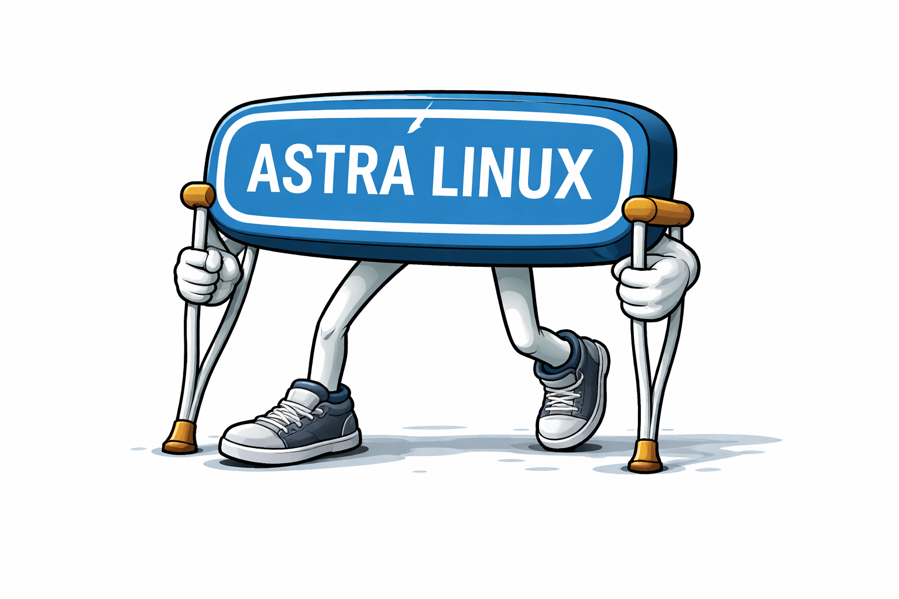

# astra-linux



Хаб системных пакетов для Astra Linux 1.8 (Debian 12).

Astra Linux 1.8 — версия снятая с поддержки. Официальные репозитории больше не работают.

Этот репо решает проблему: пакеты Debian 12 собираются через Docker на любой машине с интернетом,
раскладываются по папкам, и каждый сервер забирает только то, что ему нужно.

---

## Как это работает

**Сбор** — на машине с интернетом, Docker образ `debian:12`:
```bash
docker run --rm -v /tmp/output:/output debian:12 bash -c \
  "apt-get update -qq && apt-get install -d -y <package> && cp /var/cache/apt/archives/*.deb /output/"
```
Каждая папка — один пакет + все его зависимости, готовые к `dpkg -i`.

**Доставка** — Git sparse-checkout, скачивает только нужную папку:
```bash
git clone --filter=blob:none --sparse https://github.com/shumilovsergey/astra-linux.git
cd astra-linux
git sparse-checkout set <package>
cd <package> && dpkg -i *.deb
```

**Обновление** — пересобрать папку через Docker, заменить файлы, новый коммит.

---

## Пакеты

### Утилиты
- [git](git/README.md) — система контроля версий (устанавливается первой, через scp)
- [ufw](ufw/README.md) — файрвол
- [unzip](unzip/README.md) — распаковка архивов
- [dpkg-dev](dpkg-dev/README.md) — инструменты dpkg, включая `dpkg-scanpackages`

### NFS
- [nfs-kernel-server](nfs-kernel-server/README.md) — NFS сервер
- [nfs-common](nfs-common/README.md) — NFS клиент

### PostgreSQL
- [postgresql](postgresql/README.md) — СУБД PostgreSQL
- [postgresql-client](postgresql-client/README.md) — клиент PostgreSQL
- [postgresql-15-repmgr](postgresql-15-repmgr/README.md) — менеджер репликации repmgr
